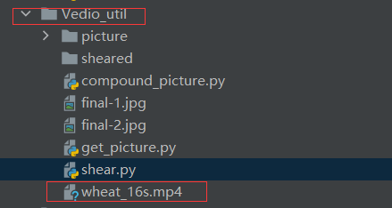
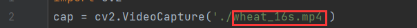
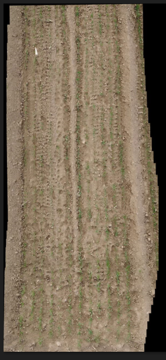
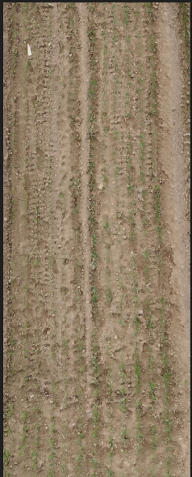
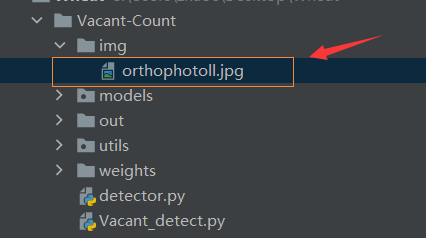
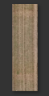
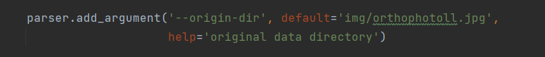
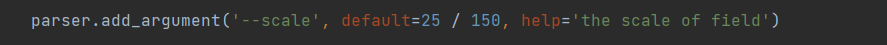
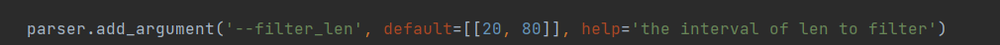
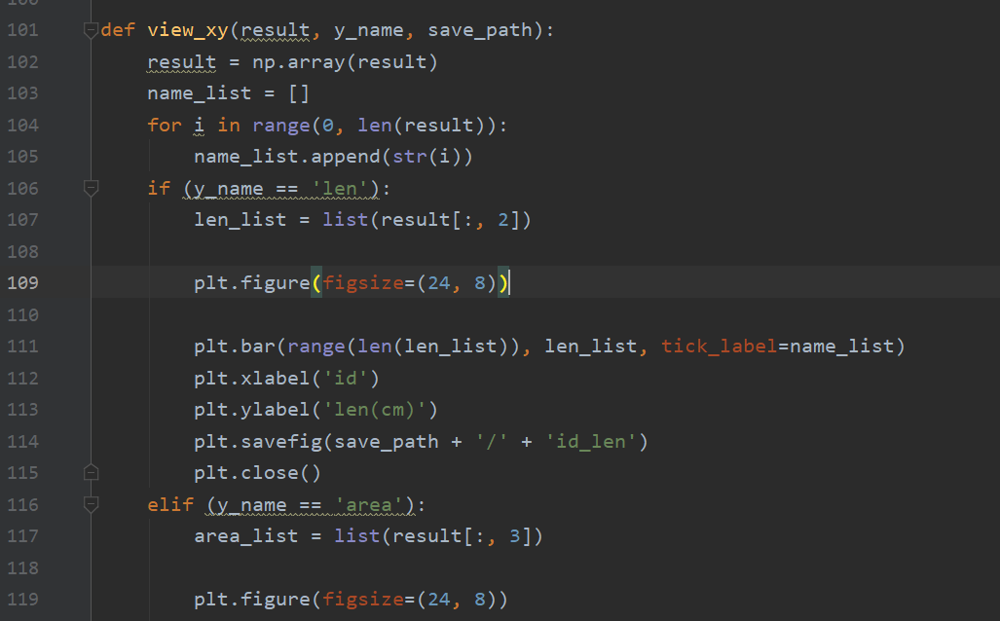

# Environment configuration：

   ### A better reading experience:   https://johnsunx1.github.io/SeedlingCV-Instraction/
   


- Python>=3.7 

- pytorch>=1.7

  `https://pytorch.org/get-started/locally/ `

  You can choose the version of pytorch that suits you to install：

  

- cuda>=10.2

- pycharm

## Project download

### Project address      
https://github.com/johnsunx1/SeedlingCV     

https://gitee.com/deepbiology/seedlingcv

https://sourceforge.net/projects/seedlingcv/


`$ cd Wheat`

`$ pip install -r requirements.txt  # install dependencies` 

# Operation guide：

## data collection

Get wheat field video by drone.Keep the drone at an appropriate altitude and level to get a clearer video of the wheat field


We provide users with a video processing toolkit：`Vedio_util`

Put the video under the `Vedio_util` folder：



### Convert video to frames

* Before converting the video into frames, you need to change the second line of `get_picture.py` to the name of your own video。




* Adjust the interval between the captured frames according to the video conditions（The interval unit is the number of frames, as follows）.The user must ensure that the two adjacent frames captured from the video have a degree of overlap greater than 70%, so as to facilitate the subsequent synthesis of the entire wheat field picture.


* The video frame can be obtained by running `get_picture.py`, and the video frame is saved in the `picture` folder. The user can select the path of the video and the interval of the video frame in `get_picture.py`, and the obtained result is saved in the `vedio_util/picture` folder.


###  Picture synthetic wheat field panorama

After getting the video frames, we need to stitch the video frames to get the panorama of the wheat field.If the panorama of the wheat field you want to synthesize is small, you can run `compound_picture.py` to synthesize the panorama, but when the wheat field is larger, we recommend using [webodm](https://github.com/OpenDroneMap/WebODM) for compositing.


Execute `compound_picture.py`, the result is final-1.jpg (original image) final-2.jpg (The image we processed for the user), the user can choose according to their actual situation and save it in the `Vedio_util` folder:

final-1：

final-2：

###  split panorama

Users can segment the panorama of the wheat field by running `shear.py`. We need to segment the panorama of the wheat field(final.jpg) so that the image specifications meet the requirements for identifying the number of wheat seedlings. （The segmented image will be used for the count of wheat seedlings, not for gap detection.The number of wheat seedlings is suitable for the two-leaf to three-leaf stage of wheat seedlings, but the wheat seedlings in the demo picture have exceeded the optimal detection period, so it is not suitable for the detection of wheat seedlings.）The obtained results are saved in `sheared`.

Here the user can select a picture to split：


## Vacancy recognition

* Put the panorama into `Vacant-Count/img`

  

* The image format is higher than width, as follows:



Avoid :


* After putting the image in, the user changes the name to the name of his own image in `Vacant_detect.py`:



* The parameter `scale` is how many centimeters each pixel represents，in fractional form：The numerator represents how many centimeters, and the denominator represents pixels. Users can choose according to the actual situation.The picture given is 150 pixels representing the actual length of 25cm.
* The parameter filter_len is the vacancy filter range，



* The parameter filter_len is the vacancy screening range. The default vacancy screening range is 20cm~80cm. The user can also set multiple screening ranges, as follows:

```python
parser.add_argument('--filter_len', default=[[20, 30],[40,50]], help='the interval of len to filter')
```

   At this time, the result only includes the statistical results of vacancies with lengths between 20~30 and 40~50, and the other length vacancies will be ignored.

* run`Vacant_detect.py`。The result is saved in `out`。


If the histogram display is not good, crowding occurs, such as:


You can try to modify the ratio of: figsize.



## Quantity detection of wheat seedlings

Put the smaller images that the panorama is divided into under `Wheat-count/Dete-orig`, and run `preprocess_detect.py` to preprocess the images into a specific format. The results obtained are under `Detect_processed`.

Run `detect.py` to get the renderings and txt files containing statistical information, and save the results to `out_dectect`.

# Reference source of the code

https://github.com/ZhihengCV/Bayesian-Crowd-Counting

https://github.com/dyh/unbox_yolov5_deepsort_counting

https://github.com/ultralytics/yolov5 

# Major contributor：

https://github.com/johnsunx1

https://github.com/14385423

https://github.com/ZCFzhaochuanfei


